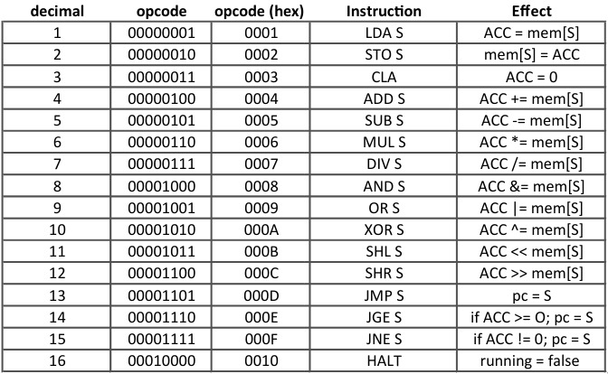

# § memory

``` c
int32_t mem[INT16_MAX];
``` 

|  memory structure  | range (in hex) |
|--------------------|----------------|
| data memory        | 0000  - 1110   |
| instruction memory | 1110  - ffff   |

this virtual machine uses a **32 bit memory** with **16 bit addresses**

example:
``` c
// address    contents
mem[0x0000] = 00030001;
mem[0x0001] = 00010000;
``` 
addresses can range from 0000 to ffff while the contents of each address can range from 00000000 to ffffffff

### why are addresses organized like this?
because instructions have **16 bits for opcode** and **16 bits for operand**, thus, an instruction like *jmp 1112* can only take 16 bits as parameter, and can be represented in memory as:

``` c
mem[0x0000] = 000d1112;   // jmp 0x1112
``` 
with *000d* being the value for the opcode JMP and *1112* as being the location in memory to where to jump

# § registers
``` c
// registers
struct reg {
    int32_t pc, cir, mar, mbr, acc;
} reg;
```

this virtual machine has 5 registers.
- pc = program counter
- cir = current instruction register
- mar = memory address register
- acc = accumulator

there is also an additional "register" that just points out whether the machine is running or not 
``` c
bool running = true;
```
>  it is deffined to be true by default

# § instructions 
the following table represents the value, mnemonic and effect of each instruction
### LDA
- LDA stands for "Load Accumulator"
- it receives an address as parameter and loads the accumulator with the value located at that address
### STO
- STO stands for "Store"
- it receives an address as parameter and loads that address with the value inside the accumulator
### CLA
- CLA stands for "Clear Accumulator"
- it receives no parameter and clears the accumulator, setting it's value to 0

### ADD
- ADD stands for "Add"
- it receives an address as parameter and adds the accumulator with the value located at that address
### SUB
- SUB stands for "Subtract"
- it receives an address as parameter and subtracts the accumulator with the value located at that address
### MUL
- MUL stands for "Multiply"
- it receives an address as parameter and multiplies the accumulator with the value located at that address
### DIV
- DIV stands for "Devide"
- it receives an address as parameter and devides the accumulator with the value located at that address

### AND
- AND stands for "logical AND"
- it receives an address as parameter and ands(&) the accumulator with the value located at that address
### OR
- OR stands for "logical OR"
- it receives an address as parameter and ors(|) the accumulator with the value located at that address
### XOR
- XOR stands for "logical Exclusive OR"
- it receives an address as parameter and xors(^) the accumulator with the value located at that address

### SHL
- SHL stands for "logical Shift Left"
- it receives an address as parameter and shifts the accumulator to the left with the value located at that address
### SHR
- SHR stands for "logical Shift Right"
- it receives an address as parameter and shifts the accumulator to the right with the value located at that address

### JMP
- JMP stands for "Jump"
- it receives an address as parameter and sets the PC to point to that address
### JGE
- JGE stands for "Jump if Greater or Equal"
- it receives an address as parameter and sets the PC to point to that address if the accumulator is greater or equal to 0
### JNE
- JNE stands for "Jump if Not Equal"
- it receives an address as parameter and sets the PC to point to that address if the accumulator is different than 0



